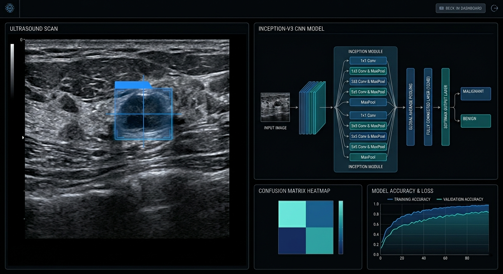

# Breast Cancer Classification with Transfer Learning

> Binary classification of breast ultrasound images into **Benign** and **Malignant** classes using five ImageNet-pretrained CNN backbones in TensorFlow / Keras.

---

## Demo Preview



---

## Overview

This project compares five popular convolutional backbones on a medical imaging task using transfer learning.  
All models are used in **feature extraction mode**: the pre-trained backbone remains frozen, while a lightweight Dense classifier is trained on top.

The notebook walks through:
- quick dataset inspection
- filename-based separation of original and augmented images
- construction of the dataframe used for downstream evaluation
- training and comparison of five backbones under the same pipeline
- confusion matrices and classification reports for each run

### Best Overall Result in the Saved Notebook Run
**ResNet50** delivered the strongest overall result.

---

## Dataset

| Property | Details |
|----------|---------|
| Name | Ultrasound Breast Cancer Images |
| Task | Binary image classification |
| Classes | `benign` / `malignant` |
| Layout | Pre-split `train/` and `val/` directories |
| File types | PNG / JPG |

### Validation Folder Audit
The notebook inspects the validation folder and separates filenames into **original** and **augmentation-derived** groups using regex rules.

Examples:
- original: `benign (12).png`
- augmented: `benign (12)-rotated1.png`

This step is included so the notebook can work with the original validation filenames explicitly instead of treating every file in the folder as a clean evaluation example.

> **Important note:** In the current notebook version, the dataframe used later for evaluation is built from **all original validation images plus an additional sampled subset of original training images** appended in Section 5. The reported metrics in the saved run reflect that exact dataframe.

---

## Models Compared

| Model | Input Size | Approx. Params |
|-------|-----------|----------------|
| InceptionV3 | 299×299 | ~21.8M |
| VGG16 | 224×224 | ~14.7M |
| ResNet50 | 224×224 | ~23.6M |
| EfficientNetB4 | 380×380 | ~17.7M |
| MobileNetV2 | 224×224 | ~2.26M |

---

## Model Head

All backbones are wrapped with the same lightweight classifier head:

```text
Pre-trained Backbone (frozen)
        ↓
Global Max Pooling
        ↓
Dense(2, activation='softmax')
```

### Training Setup
- optimizer: **AdamW** (`lr=1e-3`)
- loss: **categorical_crossentropy**
- metric: **accuracy**
- early stopping: monitor **`val_loss`**, `patience=5`, restore best weights
- backbone mode: **frozen**
- trainable layers: **final Dense layer only**

---

## Results Snapshot

The notebook logs both the running `val_accuracy` during training and a final classification report after `EarlyStopping` restores the best checkpoint by **validation loss**. Because the stopping criterion is `val_loss`, the highest logged `val_accuracy` is not always the same as the final reported accuracy.

| Model | Best `val_accuracy` seen during training | Final classification report accuracy | Notes |
|-------|------------------------------------------|--------------------------------------|-------|
| InceptionV3 | ~94.2% | ~93% | Stable baseline with solid overall behavior |
| VGG16 | ~96.7% | ~93% | Strong peak validation accuracy but weaker final restored checkpoint |
| **ResNet50** | **~98.3%** | **~98%** | Best overall performer in the saved run |
| EfficientNetB4 | ~97.5% | ~94% | High peak score with less stable final evaluation |
| MobileNetV2 | ~90.8% | ~90% | Smallest model and the lightest to run |

### Takeaways
- **ResNet50** gave the best overall result in this notebook run.
- **InceptionV3** remained a strong and stable baseline.
- **VGG16** and **EfficientNetB4** reached high peak validation accuracy, but their restored checkpoints were less convincing than ResNet50.
- **MobileNetV2** offered the smallest footprint, with the expected trade-off in accuracy.

---

## Project Structure

```text
├── Cancer-Classification-TensorFlow.ipynb
├── README.md
└── dataset/
    ├── train/
    │   ├── benign/
    │   └── malignant/
    └── val/
        ├── benign/
        └── malignant/
```

---

## How to Run

1. Clone the repository.
   ```bash
   git clone https://github.com/abdubakr77/breast-cancer-classification.git
   cd breast-cancer-classification
   ```

2. Install the dependencies.
   ```bash
   pip install tensorflow keras scikit-learn pandas numpy matplotlib seaborn
   ```

3. Update the dataset paths in the notebook configuration cell.
   ```python
   TRAIN_PATH = "path/to/your/train"
   VAL_PATH   = "path/to/your/val"
   ```

4. Run the notebook cells in order.

---

## Implementation Notes

- Model-specific preprocessing is applied through the matching Keras application utility.
- Input size changes automatically by backbone:
  - InceptionV3 → `299×299`
  - EfficientNetB4 → `380×380`
  - VGG16 / ResNet50 / MobileNetV2 → `224×224`
- Training batches are shuffled with `seed=44`.
- The notebook prints a confusion matrix and a full classification report for each model.

---

## Author

**Abdullah Bakr** — AI Engineer  
[LinkedIn](https://www.linkedin.com/in/abdubakr/) · [Kaggle Notebook](https://www.kaggle.com/code/abdullahbakr7/breast-cancer-classification-transfer-learning)

---

If you find the project useful, feel free to fork it, star it, or open an issue.
